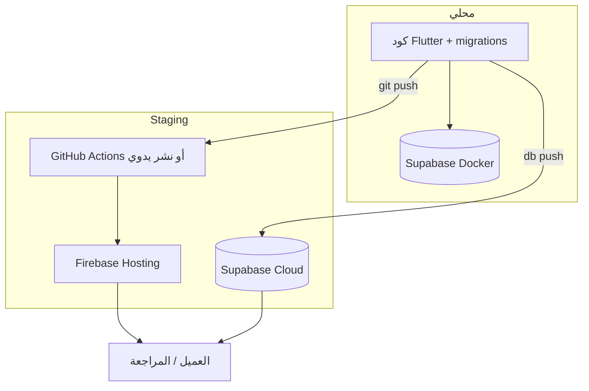

# دليل التنقل بين البيئات ونقل التعديلات

دليل مبسّط يجيب على سؤال واحد: **«أعمل محلياً — ماذا أنفّذ لأنقل التعديلات إلى Staging (أو العكس)؟»**

> للتفاصيل الكاملة راجع:
> - [دليل التشغيل المحلي](runbook-ar.md)
> - [إعداد Staging لأول مرة](staging-setup-ar.md)
> - [ملفات التكوين `config/dart-defines/`](../config/dart-defines/README.md)

---

## 1. البيئات في المشروع

| البيئة | قاعدة البيانات | واجهة الويب | ملف التكوين |
| --- | --- | --- | --- |
| **محلي (local)** | Docker على جهازك `127.0.0.1:55321` | `flutter run` على Chrome | `config/dart-defines/web.local.json` |
| **Staging** | Supabase سحابي `*.supabase.co` | `https://rafiq-alhajj-staging.web.app` | `config/dart-defines/web.staging.json` |
| **إنتاج (production)** | مشروع Supabase منفصل (لاحقاً) | موقع Firebase منفصل (لاحقاً) | `config/dart-defines/web.production.json` |



---

## 2. ماذا يُنقل؟ وأين؟

| نوع التعديل | أين يُحفظ | كيف يصل إلى Staging |
| --- | --- | --- |
| كود Dart / Flutter | Git | `git push` إلى `main` (نشر تلقائي) **أو** `npm run staging:deploy` |
| Migrations قاعدة البيانات | `supabase/migrations/` | `npm run staging:setup-db` |
| Edge Functions | `supabase/functions/` | ضمن `staging:setup-db` أو `supabase functions deploy` |
| مفاتيح Supabase / Firebase (التطبيق) | `config/dart-defines/*.json` | **لا تُرفع على Git** — تُعدَّل يدوياً لكل بيئة |
| أسرار Staging لسكربتات CLI | `config/.env.staging.local` | **مرة واحدة** — يقرأها `staging:setup-db` تلقائياً |
| بيانات تجريبية (seed) | `supabase/seed.sql` | `staging:setup-db` (أو SQL Editor يدوياً) |
| حسابات demo | `scripts/seed-demo-users.json` | `npm run staging:seed-users` |

**قاعدة ذهبية:** الكود يمر عبر Git. قاعدة البيانات تمر عبر `db push`. أسرار التطبيق في `dart-defines`، وأسرار السكربتات في `.env.staging.local`.

### إعداد ثابت لمتغيرات Staging (مرة واحدة)

```powershell
npm run config:bootstrap
# يُنشئ config/.env.staging.local من القالب إن لم يكن موجوداً

notepad config\.env.staging.local
```

املأ على الأقل:

```env
SUPABASE_PROJECT_REF=lopekeucmtejfjtpfzph
SUPABASE_URL=https://lopekeucmtejfjtpfzph.supabase.co
SUPABASE_SERVICE_ROLE_KEY=eyJ...   # Dashboard → API → service_role
SUPABASE_DB_PASSWORD=...           # Dashboard → Database → password (مهم لـ db push)
```

> **اختصار:** إذا كان `config/dart-defines/web.staging.json` يحتوي `SUPABASE_URL` صحيحاً، يُستنتج `SUPABASE_PROJECT_REF` تلقائياً.

بعدها شغّل مباشرة بدون `$env:...` في كل مرة:

```powershell
npm run staging:setup-db
npm run staging:seed-users
```

---

## 3. أوامر التشغيل حسب البيئة

### محلي — Supabase على Docker

```powershell
npm run setup          # db reset + seed + حسابات demo (بعد تغيير migrations)
npm run dev            # ويب + Supabase محلي
npm run dev:android    # أندرويد + Supabase محلي
```

### Staging — تجربة محلية ضد السحابة (بدون نشر)

```powershell
npm run dev:web:staging       # Chrome يتصل بـ Supabase Staging
npm run dev:android:staging   # أندرويد يتصل بـ Supabase Staging
```

### Staging — نشر للعميل

```powershell
npm run staging:deploy              # بناء + نشر ويب يدوياً
npm run staging:distribute-android  # بناء + رفع APK للمختبرين
```

---

## 4. السيناريوهات الشائعة (خطوة بخطوة)

### السيناريو أ — أعمل يومياً محلياً

```powershell
# مرة عند أول تشغيل أو بعد سحب migrations جديدة
supabase start
npm run setup

# كل يوم
npm run dev              # مشغل / مسؤول (ويب)
# أو
npm run dev:android      # حاج / تقني ميداني
```

بعد تعديل `@riverpod` / `freezed`:

```powershell
dart run build_runner build --delete-conflicting-outputs
```

---

### السيناريو ب — غيّرت كود Flutter فقط (بدون migrations)

**الهدف:** نشر الواجهة على Staging.

**الطريقة 1 — تلقائي (موصى بها):**

```powershell
git add .
git commit -m "وصف التعديل"
git push origin main
```

GitHub Actions يبني وينشر خلال بضع دقائق → `https://rafiq-alhajj-staging.web.app`

**الطريقة 2 — يدوي (فوري من جهازك):**

```powershell
npm run staging:deploy
```

> لا حاجة لـ `staging:setup-db` إذا لم تلمس `supabase/migrations/`.

---

### السيناريو ج — أضفت migration جديدة

**مثال:** جدول `app_version_policies` أو عمود جديد.

**1. محلياً — تحقق:**

```powershell
npm run setup
# أو: supabase db reset && npm run setup:users
```

**2. Staging — طبّق الـ migration:**

```powershell
# مرة واحدة: املأ config/.env.staging.local (انظر القسم 2 أعلاه)
npm run staging:setup-db
```

هذا الأمر يقوم بـ: `supabase link` → `db push` → seed → نشر Edge Functions → (اختياري) حسابات demo.

**3. انشر الكود** (إذا التطبيق يعتمد على الجدول الجديد):

```powershell
git push origin main
# أو
npm run staging:deploy
```

---

### السيناريو د — أريد تجربة كودي ضد Staging قبل النشر

مفيد عندما تريد التأكد أن التطبيق يعمل مع قاعدة Staging الحقيقية:

```powershell
# تأكد أن web.staging.json مملوء (مرة واحدة)
npm run config:bootstrap

npm run dev:web:staging
```

> **ملاحظة:** إذا ظهر خطأ مثل `Could not find table 'app_version_policies'` — الـ migration لم تُطبَّق على Staging بعد → نفّذ السيناريو ج.

---

### السيناريو هـ — غيّرت Edge Function فقط

```powershell
$env:SUPABASE_PROJECT_REF = "your-project-ref"
supabase functions deploy create-pilgrim --project-ref $env:SUPABASE_PROJECT_REF
# كرّر لكل function عدّلتها
```

أو شغّل `npm run staging:setup-db` (ينشر كل الـ functions المعروفة).

---

### السيناريو و — أريد إعادة حسابات demo على Staging فقط

```powershell
npm run staging:seed-users
```

> يقرأ `SUPABASE_URL` و`SERVICE_ROLE_KEY` من `config/.env.staging.local` تلقائياً.

---

### السيناريو ز — أريد مشاركة APK مع العميل (أندرويد)

```powershell
# مرة واحدة
npm run staging:setup-app-distribution

# كل إصدار
npm run staging:distribute-android
```

راجع [staging-setup-ar.md §10](staging-setup-ar.md) للتفاصيل.

---

### السيناريو ح — إعداد Staging من الصفر (أول مرة)

```powershell
npm run staging:wizard
```

أو اتبع [staging-setup-ar.md](staging-setup-ar.md) يدوياً.

---

## 5. مخطط قرار سريع

```
هل عدّلت supabase/migrations/ ؟
│
├─ نعم → npm run setup (محلي)
│         ثم npm run staging:setup-db (staging)
│         ثم git push أو staging:deploy
│
└─ لا  → هل تريد نشر الواجهة فقط؟
          │
          ├─ نعم → git push origin main
          │         (أو npm run staging:deploy يدوياً)
          │
          └─ لا  → npm run dev (محلي)
                    أو npm run dev:web:staging (تجربة ضد سحابة)
```

---

## 6. جدول أوامر مرجعي (نسخ ولصق)

| المهمة | الأمر |
| --- | --- |
| إعداد محلي كامل | `npm run setup` |
| تشغيل ويب محلي | `npm run dev` |
| تشغيل ويب ضد Staging DB | `npm run dev:web:staging` |
| دفع migrations إلى Staging | `npm run staging:setup-db` |
| نشر ويب Staging يدوياً | `npm run staging:deploy` |
| إعادة حسابات demo على Staging | `npm run staging:seed-users` |
| توزيع APK Staging | `npm run staging:distribute-android` |
| توليد كود Riverpod/Freezed | `dart run build_runner build --delete-conflicting-outputs` |
| إنشاء ملفات التكوين | `npm run config:bootstrap` |

---

## 7. أخطاء شائعة عند النقل بين البيئات

| الرسالة / المشكلة | السبب | الحل |
| --- | --- | --- |
| `Could not find the table '...'` على Staging | Migration غير مطبّقة على السحابة | `npm run staging:setup-db` |
| التطبيق يعمل محلياً ويفشل على Staging | ملف `web.staging.json` ناقص أو مفاتيح خاطئة | راجع `config/dart-defines/web.staging.json` |
| `db push` يعلق عند `Initialising login role...` | مشكلة معروفة في Supabase CLI + pooler | أضف `SUPABASE_DB_PASSWORD` في `config/.env.staging.local` (كلمة مرور قاعدة البيانات من Dashboard → Database) ثم أعد الأمر. أو `SUPABASE_SKIP_POOLER=true` |
| `staging:setup-db` يطلب `SUPABASE_PROJECT_REF` | ملف `config/.env.staging.local` غير مملوء | `npm run config:bootstrap` ثم عدّل `.env.staging.local` |
| نشر GitHub Actions ناجح لكن الصفحة قديمة | كاش المتصفح | Ctrl+Shift+R أو نافذة خاصة |
| `db reset` يمحو بياناتي المحلية | سلوك متوقع | `db reset` يعيد البناء من migrations + seed |
| Staging فيه بيانات حقيقية للعميل | `staging:setup-db` يعيد seed | **احذر:** seed قد يكتب فوق بيانات تجريبية — على Staging النشط استخدم `db push` فقط بدون seed إن لزم |

---

## 8. الفرق بين المحلي و Staging (تذكير)

| | محلي | Staging |
| --- | --- | --- |
| Supabase | Docker على جهازك | مشروع سحابي مجاني |
| إعادة بناء DB | `supabase db reset` آمن دائماً | `db push` يضيف migrations؛ seed بحذر |
| حسابات التجربة | `npm run setup:users` | `npm run staging:seed-users` |
| رابط العميل | `localhost` | `rafiq-alhajj-staging.web.app` |
| كلمة مرور demo | `demo123456` | `demo123456` (للتجربة فقط) |

---

## 9. الإنتاج (لاحقاً)

عند الجاهزية:

1. مشروع Supabase **منفصل** للإنتاج.
2. موقع Firebase Hosting **منفصل**.
3. ملف `config/dart-defines/web.production.json`.
4. workflow GitHub منفصل (لا تنشر production من `main` بدون مراجعة).
5. **عطّل** حسابات `demo@` أو غيّر كلمات المرور.

نفس المنطق: كود عبر Git، schema عبر `db push`، أسرار في dart-defines المحلية/CI secrets.

---

*آخر تحديث: 2026-07-07*
