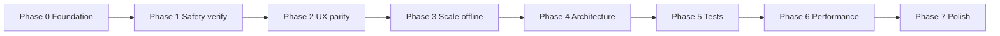

# Rafiq Al-Hajj — Optimization Roadmap

> **Goal:** Make the app as robust, performant, and polished as international-grade Hajj/companion products (Coursera-style offline learning, Duolingo-style progress, Slack/iOS-grade notifications, Airtable-style staff ops).
>
> **Scope:** All review points from the 2026-07-06 architecture audit. This document is the single source of truth for phased execution.

---

## Principles (expert best practices)

Apply these on **every** phase — not optional polish at the end.

| Principle | What it means here |
| --- | --- |
| **Verify before refactor** | Device + staging smoke tests for safety-critical paths (SOS, push, offline media) before large UI splits. |
| **Thin widgets, fat services** | Screens ≤ ~300 lines; business logic in `application/services/`; Supabase only in `data_sources/`. |
| **Offline-first catalog, secure media** | JSON catalog cache (stale-while-revalidate) + encrypted media bucket; never block UI on network for read paths. |
| **Fail visibly, recover gracefully** | Localized errors, retry/backoff, empty states — no silent `catch (_)`. |
| **`.select()` everywhere** | Riverpod rebuilds minimized; list screens use pagination at the data layer. |
| **One widget per file** | Extract private sub-widgets when a screen grows past ~250 lines. |
| **Theme tokens only** | `colorScheme` / `AppColors` — no hardcoded surfaces (dark mode is not optional). |
| **Web-aware sizing** | Staff + wide pilgrim screens: `sw()/sh()/ss()` from `staff_web_metrics.dart`; pilgrim mobile keeps `.w/.h/.sp`. |
| **Tests on parsers & state machines** | Import parser, tabular codec, media download FSM, push navigation dedup — high ROI unit tests. |
| **Staging gate** | No production force-update or push policy change without staging checklist pass. |

---

## Phase 0 — Foundation & quality gates

**Objective:** Establish measurable quality bars so later phases do not regress.

### 0.1 Staging verification checklist

Create `docs/qa/staging-smoke-checklist.md` with role-based flows:

- [ ] Admin: dashboard KPIs match DB for active trip
- [ ] Operator (group-scoped): sees only assigned group pilgrims
- [ ] Pilgrim: home feed (announcements → news → library), continue learning, offline banner
- [ ] Push: broadcast → tray + inbox + tap navigation (Android + web)
- [ ] SOS: raise → staff map live update → resolve
- [ ] Import: Excel template → preview → upsert → export round-trip
- [ ] App version: optional prompt + force block (staging policies)

**Deliverable:** Checklist + `npm run qa:staging` script that prints URLs, test accounts, and migration reminder.

### 0.2 CI expansion

Extend `.github/workflows/flutter_ci.yml`:

| Step | Purpose |
| --- | --- |
| `dart analyze` | Already present — keep zero-warning policy |
| `flutter test` | Add unit tests (see Phase 5) |
| `dart format --set-exit-if-changed .` | Format gate |
| Optional: `supabase db reset` in CI | Migration sanity (Docker job) |

### 0.3 Observability baseline

- Wire `CrashReporter` breadcrumbs on: auth sign-in/out, SOS raise/resolve, media download fail, push open.
- Add debug-only structured logs (`_logX(where, e)`) pattern to remaining silent catch blocks.
- Admin: ensure push failure log (`/admin/notifications/failures`) is linked from runbook.

### 0.4 Retire dead tooling

- Remove or archive `scripts/seed-fake-pilgrim-registry.mjs` (targets dropped `pilgrim_details`).
- Document replacement: `npm run setup:users` + `supabase/seed.sql`.

**Exit criteria:** CI green with new tests stub; staging checklist exists; no obsolete scripts in `package.json`.

---

## Phase 1 — Safety-critical verification (P0)

**Objective:** Prove production-critical paths on real devices before structural refactors.

### 1.1 Content & offline media (`lib/features/content/`)

**Review matrix (device + web):**

| Scenario | Platform | Pass criteria |
| --- | --- | --- |
| Public topic: download all → airplane mode → play video/audio/PDF | Android/iOS | Decrypted local playback |
| Private `pilgrim_only` topic | Android/iOS | Signed URL online; download works offline |
| Wi-Fi-only gate | Android | `waitingForWifi` → connect Wi-Fi → auto-resume |
| Quota + LRU eviction | Android | Usage bar accurate; oldest evicted at cap |
| Logout | All | Encrypted cache wiped; re-login does not leak prior user media |
| Stories gallery | Mobile | Auto-advance, tap zones, pause-on-hold |
| PDF | Web + mobile | Renders via pdf.js CDN (web) / pdfx (mobile) |
| News/announcement cover | All | `ResolvedCoverImage` offline fallback |

**Optimizations after verification:**

1. Split `content_media_cache_service.dart` (~560 lines):
   - `media_download_coordinator.dart` — queue, Wi-Fi, retry
   - `media_playback_resolver.dart` — URL resolution order
   - Keep thin facade `ContentMediaCacheService`
2. Split `admin_content_topic_edit_screen.dart`:
   - `_MediaDraftCard` → own file
   - `_TopicMediaList` → own file
   - Migrate media drafts to `FormArray` (reactive_forms) — remove `TextEditingController` rows
3. Freezed remaining domain models: `ContentTopic`, `ContentTopicMedia`, `ContentMediaProgress`
4. Add `ContentDownloadRecovery` — on app resume, reconcile manifest vs disk

**International benchmark:** Coursera / Udemy offline downloads — explicit states (queued/downloading/paused/complete), storage meter, Wi-Fi-only default.

### 1.2 Push notifications (`lib/features/notifications/`)

**Review matrix:**

| Scenario | Pass criteria |
| --- | --- |
| Cold start tap | Pending queue navigates correctly |
| Foreground Android | Heads-up notification (not only SnackBar) |
| Web background | SW shows notification; click focuses tab |
| Quiet hours | Non-urgent suppressed; urgent bypasses |
| Category prefs | Disabled category → no FCM for that type |
| Mark read on tap | Inbox row `read_at` set |
| Token re-login | Sign out → sign in → token re-registers (no `deleteToken`) |
| Admin retry | Failed row → Retry → success or new failure logged |

**Optimizations:**

1. **Defer permission** — request after pilgrim login + rationale dialog (not cold start); keep `PushNotificationStarter` post-frame.
2. Fill `web/firebase-messaging-sw.js` + staging dart-defines for web FCM.
3. Extract `notification_list_screen.dart` sections: header, filter bar, day group, tile → separate widget files.
4. Integration test: `push_message_navigation` dedup + route resolution (unit).

**International benchmark:** iOS Mail / Slack — grouped notifications, quiet hours, per-channel/category mute, badge sync.

### 1.3 SOS & live location (`lib/features/sos/`)

**Review matrix:**

| Scenario | Pass criteria |
| --- | --- |
| Raise SOS | RPC creates alert + notifies operators/admins |
| Foreground pings | Map updates within debounce window |
| Realtime | Staff monitor updates without manual refresh |
| Resolve | Alert cleared; pilgrim UI returns to idle |
| Concurrent alerts | Multiple pilgrims visible on map |

**Optimizations:**

1. Ping strategy: increase `distanceFilter` when speed ≈ 0; cap max ping rate (e.g. 30s min interval).
2. Staff UI: show `lastLocationAt` relative time on marker callout.
3. Battery: pause stream when app `paused` (already foreground-only — document clearly in pilgrim UI).
4. E2E test: mock `LocationRepository` + RPC response (unit); staging script inserts test alert.

**International benchmark:** Uber/Waze live share — clear “sharing location” state, staff sees freshness indicator.

### 1.4 Operator registry & import (`lib/features/operator_intake/`)

**Review matrix:**

| Scenario | Pass criteria |
| --- | --- |
| RLS group scope | Operator A sees only group A enrollments |
| Import preview | Create/update/error counts before commit |
| Bulk edit + notify | Only changed logistics fields trigger notification |
| Export → re-import | Round-trip without data loss |
| WhatsApp reset password | Only when login + WhatsApp present |

**Optimizations:**

1. Split `operator_pilgrim_list_screen.dart` (858 lines):
   - `operator_pilgrim_table.dart` — column defs
   - `operator_pilgrim_toolbar.dart` — import/export/template
   - `operator_pilgrim_filters.dart` — trip + filters
2. Load-test `fetchPage` with 500+ enrollments — measure query time; add DB indexes if needed.
3. Import edge fn: optional `notify` flag for large batches (future-safe hook).

**Exit criteria:** Staging checklist sections 1.1–1.4 signed off on Android + one web browser.

---

## Phase 2 — Staff & mobile UX parity (P1)

**Objective:** Staff web quality bar extended to field operator mobile and remaining light-theme leaks.

### 2.1 Field operator mobile (`lib/features/field_operator/`)

| Task | Detail |
| --- | --- |
| Dark mode | Replace `AppColors.background/surface` with `Theme.of(context).colorScheme` |
| List UX | Evaluate shared patterns: `StaffCellText`, density, pull-to-refresh consistency |
| Feature parity gap | Document vs web operator: import/export/bulk edit — product decision: add mobile simplified import OR deep-link to web |
| Pilgrim detail | Align `PilgrimProfileSections` with operator web detail field groups |

### 2.2 Dark theme sweep (pilgrim + field)

Audit grep: `AppColors\.(background|surface)` in `lib/features/**` — migrate to `colorScheme` except brand accents in `AppColors`.

Files known to need pass:

- `field_operator_*_screen.dart`
- Any pilgrim screen still using static light surfaces

### 2.3 Admin dashboard performance (`lib/features/admin_analytics/`)

| Task | Detail |
| --- | --- |
| Query consolidation | Single RPC `fetch_admin_dashboard_stats(p_trip_id)` replacing N parallel queries |
| Realtime debounce | Reuse `realtime_refresh.dart` debounce pattern |
| Loading UX | `skipLoadingOnReload` on trip change; skeleton KPI cards |
| Verify KPIs | Cross-check SOS count, push reach %, unassigned pilgrims against raw SQL |

**International benchmark:** Linear/Airtable ops dashboards — fast filter (trip), urgent banner, scannable KPIs.

### 2.4 App version gate (`lib/features/app_version/`)

- Apply migration on staging; set real `store_url` (Firebase App Distribution / Play / App Store).
- Test force-update block and optional dismiss-per-version.
- Document admin workflow in runbook.

**Exit criteria:** Field operator readable in OS dark mode; dashboard loads < 2s on staging with active trip.

---

## Phase 3 — Scale & offline depth (P2)

**Objective:** Performance and offline behavior that holds at 1k+ pilgrims and poor Hajj-site connectivity.

### 3.1 Competitions (`lib/features/competitions/`)

| Task | Detail |
| --- | --- |
| Admin pagination | Replace `fetchAll()` with `fetchPage(query)` + `StaffDataTable` server pagination (mirror content/operators) |
| Offline questions | Cache competition + questions in `ContentCatalogCache` on first fetch; quiz play from cache when offline |
| Refactor | Split `competition_quiz_screen.dart`, `admin_competition_question_editor_dialog.dart` |
| Freezed | `CompetitionQuestion`, `CompetitionQuestionOption`, `CompetitionQuizProgress` |
| Shared UI | Extract generic `LearningPathScaffold` shared with `hajj_journey` |

### 3.2 Hajj journey (`lib/features/hajj_journey/`)

| Task | Detail |
| --- | --- |
| Offline UX | Prominent download on ritual detail (reuse `HajjJourneyOfflineActions`) |
| Catalog | Already cached — add connectivity banner when showing stale steps |
| Admin editor | Media draft `FormArray` (same as content topics) |
| Path UI | Share connector/node widgets with competitions learning path |

### 3.3 Content catalog hardening

| Task | Detail |
| --- | --- |
| `contentDetailProvider` | Already has realtime — verify invalidation on publish |
| Background refresh | `contentCatalogRefreshBinding` — add user-visible “Updated” snackbar optional |
| Image pipeline | Ensure all covers use `ResolvedCoverImage` (grep `Image.network` — only 2 files remain) |

### 3.4 Operator list at scale

- Index review on `trip_enrollments(trip_id, group_id)`, `pilgrims(passport_number)`.
- Column picker: default visible columns for mobile field operator (subset).
- Virtualize long lists if `ListView` jank observed (`ListView.builder` audit).

**Exit criteria:** Admin competitions list paginated; quiz playable offline after one online visit; journey steps available offline.

---

## Phase 4 — Architecture cleanup (P3)

**Objective:** Reduce god-files and complete 4-layer consistency.

### 4.1 Screen decomposition targets

| File | Target extraction |
| --- | --- |
| `operator_pilgrim_list_screen.dart` | table, toolbar, filters, bulk actions |
| `notification_list_screen.dart` | header, segments, group, tile |
| `pilgrim_field_catalog.dart` | field defs, form builder, payload mapper |
| `admin_content_topic_edit_screen.dart` | media draft card, cover section, notify toggle |
| `admin_dashboard_screen.dart` | urgent banner, KPI grid, charts |
| `home_screen.dart` | section widgets already partial — extract prayer hero, feed sections |

### 4.2 Application layer purity

Audit and move any remaining `SupabaseClient` usage out of `application/`:

- `pilgrim_dashboard_service.dart`
- `pilgrim_intake_service.dart`
- `content_notification_service.dart`

Pattern: service → repository → data source only.

### 4.3 Reactive forms completion

- Admin topic media rows → `FormArray`
- Hajj journey media drafts → `FormArray`
- Search fields stay `TextEditingController` (intentional)

### 4.4 Provider graph hygiene

- Review large `.g.dart` files (`competitions_providers.g.dart`) — split providers per screen domain if needed.
- `keepAlive` audit: document which providers must survive (`staff_sidebar`, `staff_table_density`, router).

**Exit criteria:** No presentation file > 400 lines except generated; no Supabase in application layer.

---

## Phase 5 — Test pyramid & automation (P3)

**Objective:** International apps ship with CI confidence — not only manual QA.

### 5.1 Unit tests (high ROI first)

| Module | Test file | Cases |
| --- | --- | --- |
| `pilgrim_import_parser.dart` | `test/operator_intake/pilgrim_import_parser_test.dart` | header match AR/EN, dates, gender, dup passport |
| `tabular_codec.dart` | `test/core/tabular_codec_test.dart` | CSV BOM, XLSX round-trip, Excel serial dates |
| `content_media_cache_service.dart` | `test/content/media_download_validation_test.dart` | reject HTML, oversize, empty |
| `push_message_navigation.dart` | `test/notifications/push_navigation_test.dart` | route map, dedup ids |
| `upload_validation.dart` | `test/core/upload_validation_test.dart` | MIME, size caps |
| `AppVersionService` | `test/app_version/version_compare_test.dart` | semver compare, force vs optional |

### 5.2 Widget tests

- `AppRoot` (exists)
- `ForceUpdateScreen` — blocks interaction
- `ContentOfflineBanner` — shows when offline
- `StaffCellText` — ellipsis + placeholder

### 5.3 Integration / staging

- GitHub Actions: optional nightly staging smoke (external) or documented manual cadence.
- Supabase: `supabase test db` or SQL probes for RLS (operator group isolation).

**Exit criteria:** CI runs ≥ 15 meaningful tests; import parser and codec at 90%+ branch coverage.

---

## Phase 6 — Performance & startup (P4)

**Objective:** Cold start and scroll performance comparable to top-tier consumer apps.

### 6.1 Startup sequence

```
main → AppBootstrap → AppRoot → first frame
                              → post-frame: push bind (logged-in only)
                              → post-frame: catalog prefetch (optional, Wi-Fi)
```

| Task | Detail |
| --- | --- |
| Lazy Firebase | Init on first auth session, not guest |
| Catalog prefetch | After login, background `ContentCatalogService.refreshAll()` on Wi-Fi |
| Image cache | `cacheWidth` / `memCacheWidth` on list thumbnails |
| `const` constructors | Pass on list tiles, chips, icons |

### 6.2 List & chart performance

- `StaffDataTable`: `RepaintBoundary` on rows if profiling shows paint cost.
- Admin charts: limit data points; aggregate “other” bucket.
- Competitions learning path: lazy-build off-screen nodes.

### 6.3 Memory

- Video: dispose `ChewieController` / `VideoPlayerController` aggressively on route pop.
- WebView embeds: limit concurrent YouTube/Vimeo instances to 1.

**Exit criteria:** Debug cold start no > 2s blocked first frame on mid-range Android (profile mode); home scroll 60fps in profile.

---

## Phase 7 — Polish & international product patterns (P4)

**Objective:** UX details that distinguish regional apps from global ones.

### 7.1 Notifications & engagement

- Rich notification text (AR/EN) — already in Edge fn; verify truncation limits.
- App icon badge (`app_badge_plus`) sync on inbox open/mark-all-read.
- Deep links: every notification `route` has a test case.

### 7.2 Learning & progress

- Continue learning card on home (exists) — add “last watched %” on topic cards.
- Competitions: streak / daily goal (optional product scope).
- Hajj journey: step completion checkmarks synced when online.

### 7.3 Accessibility & i18n

- Semantics labels on SOS button, notification tiles, map markers.
- Minimum touch targets 48dp on mobile.
- RTL audit on new staff components (`Directionality` / `EdgeInsetsDirectional`).

### 7.4 Islamic tools & virtual tour

- Prayer times: cache last known location result; show stale indicator.
- Virtual tour: low-end Android test; fallback image if panorama fails.
- Tools hub: consistent offline badges.

### 7.5 Support contacts

- `tel:` / WhatsApp analytics hook (debug log only).
- Admin reorder (`sort_order`) drag-and-drop (optional).

---

## Execution map



**Parallel tracks after Phase 1:**

- Track A: Phases 2 + 4 (UX + refactor)
- Track B: Phase 3 (offline + pagination)
- Track C: Phase 5 (tests alongside each feature fix)

---

## Definition of done (global)

A phase item is **done** only when:

1. Code merged with `flutter analyze` → no issues.
2. `build_runner` + `gen-l10n` run if models/ARB changed.
3. Relevant tests added or staging checklist row checked.
4. Memory Bank `progress.md` updated.
5. No new hardcoded colors/strings/sizes outside conventions.

---

## Feature → phase index

| Feature | Primary phases |
| --- | --- |
| Content offline media | 1, 3, 5, 6 |
| Push notifications | 1, 6, 7 |
| SOS | 1, 7 |
| Operator registry / import | 1, 3, 4, 5 |
| Field operator mobile | 2 |
| Admin dashboard | 2, 6 |
| App version gate | 2 |
| Competitions | 3, 4, 5 |
| Hajj journey | 3, 4 |
| Dark theme | 2 |
| Architecture / god files | 4 |
| Test coverage | 0, 5 |
| Startup performance | 6 |
| Islamic tools / virtual tour | 7 |
| Support contacts | 7 |
| Staging / CI / dead scripts | 0 |

---

## Suggested first sprint (start here)

1. **Phase 0.1** — Write staging smoke checklist.
2. **Phase 1.1** — Run content offline matrix on Android staging build.
3. **Phase 1.2** — Complete web FCM config + push matrix.
4. **Phase 5.1** — Add `pilgrim_import_parser_test` + `tabular_codec_test` (quick CI win).
5. **Phase 2.1** — Field operator dark mode fix (small diff, high visibility).

---

## References

- Architecture: `memory-bank/systemPatterns.md`, `.cursorrules`
- Staging: `docs/staging-setup-ar.md`
- Push setup: `docs/push-notifications-setup.md`
- Ops: `docs/runbook-ar.md`
