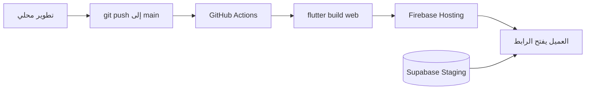

# نشر بيئة Staging مجانية (رابط ثابت للعميل)

دليل إعداد بيئة تجريبية على السحابة **مجانية** لمشروع رفيق الحج، مع رابط ويب ثابت يمكن مشاركته مع العميل.

| المكوّن | الخدمة | الرابط الثابت |
| --- | --- | --- |
| واجهة الويب (Flutter Web) | Firebase Hosting | `https://rafiq-alhajj-staging.web.app` |
| قاعدة البيانات + Auth | Supabase (Free) | `https://<project-ref>.supabase.co` |

> **تنبيه:** كلمات مرور الحسابات التجريبية (`demo123456`) للـ Staging فقط — لا تستخدمها في الإنتاج.

---

## نظرة عامة



بعد الإعداد لمرة واحدة، كل دفع (`push`) إلى `main` يعيد بناء ونشر نسخة Staging تلقائياً خلال بضع دقائق.

---

## 1. المتطلبات

| الأداة | الغرض |
| --- | --- |
| حساب [Supabase](https://supabase.com) | Backend مجاني |
| حساب [Firebase](https://console.firebase.google.com) | استضافة الويب (المشروع `rafiq-alhajj` موجود مسبقاً) |
| حساب GitHub | نشر تلقائي عبر Actions |
| Flutter SDK 3.11+ | بناء الويب محلياً (اختياري) |
| Supabase CLI | `npm i -g supabase` أو [تثبيت CLI](https://supabase.com/docs/guides/cli) |
| Firebase CLI | `npm i -g firebase-tools` |

**التكلفة:** Supabase Free + Firebase Spark = **0$** للتجربة والمراجعة مع العميل.

---

## 2. إنشاء مشروع Supabase Staging

1. افتح [Supabase Dashboard](https://supabase.com/dashboard) → **New project**.
2. اختر اسماً مثل `rafiq-alhajj-staging` وكلمة مرور قوية لقاعدة البيانات.
3. انتظر حتى يكتمل الإنشاء، ثم انسخ **Project Reference ID** من:
   **Project Settings → General → Reference ID**.

### رفع الـ migrations والبيانات التجريبية

من جذر المشروع:

```bash
export SUPABASE_PROJECT_REF=your-project-ref
export SUPABASE_SERVICE_ROLE_KEY=your-service-role-key   # من Dashboard → API

supabase login
npm run staging:setup-db
```

هذا السكربت يقوم بـ:

- `supabase link` + `supabase db push` (كل migrations)
- تطبيق `supabase/seed.sql` (محتوى عربي تجريبي)
- نشر Edge Functions
- إنشاء حسابات Auth التجريبية (`admin@demo.local`, `operator@demo.local`, …)

### إعداد Auth لرابط Staging

في Supabase Dashboard → **Authentication → URL Configuration**:

| الحقل | القيمة |
| --- | --- |
| Site URL | `https://rafiq-alhajj-staging.web.app` |
| Redirect URLs | `https://rafiq-alhajj-staging.web.app/**` |
| | `https://rafiq-alhajj-staging.firebaseapp.com/**` |

---

## 3. إعداد Firebase Hosting (موقع Staging)

```bash
firebase login
npm run staging:setup-hosting
```

ينشئ موقع الاستضافة `rafiq-alhajj-staging` ويربطه بهدف النشر `staging`.

**الرابط الثابت للعميل بعد أول نشر:**

- https://rafiq-alhajj-staging.web.app
- https://rafiq-alhajj-staging.firebaseapp.com

---

## 4. ملفات التكوين (منصة × بيئة)

```powershell
npm run config:bootstrap
```

ينشئ ملفات الأسرار من القوالب في `config/dart-defines/`:

| السيناريو | الملف |
| --- | --- |
| ويب · محلي | `config/dart-defines/web.local.json` |
| ويب · staging | `config/dart-defines/web.staging.json` |
| Android محاكي · محلي | `config/dart-defines/android.local.json` |
| Android جهاز حقيقي · محلي | `config/dart-defines/android-device.local.json` |
| Android · staging | `config/dart-defines/android.staging.json` |

القوالب المرفوعة على Git: `config/dart-defines/*.example.json`

> الملفات بدون `.example` **غير مرفوعة على Git**. راجع `config/dart-defines/README.md`.

مثال محتوى `web.staging.json`:

```json
{
  "APP_ENV": "staging",
  "APP_PLATFORM": "web",
  "SUPABASE_URL": "https://YOUR_PROJECT_REF.supabase.co",
  "SUPABASE_ANON_KEY": "eyJ...",
  "CRASH_REPORTING_ENABLED": "false",
  "FIREBASE_PROJECT_ID": "rafiq-alhajj",
  "FIREBASE_API_KEY": "...",
  "FIREBASE_WEB_APP_ID": "1:...:web:...",
  "FIREBASE_MESSAGING_SENDER_ID": "...",
  "FIREBASE_AUTH_DOMAIN": "rafiq-alhajj.firebaseapp.com",
  "FIREBASE_STORAGE_BUCKET": "rafiq-alhajj.firebasestorage.app",
  "FIREBASE_VAPID_KEY": "...",
  "FIREBASE_MEASUREMENT_ID": ""
}
```

### نشر يدوي من جهازك

```bash
npm run staging:deploy
```

---

## 5. النشر التلقائي عبر GitHub Actions (موصى به)

### أ) إنشاء Service Account لـ Firebase

1. [Google Cloud Console](https://console.cloud.google.com) → مشروع `rafiq-alhajj`.
2. **IAM & Admin → Service Accounts → Create**.
3. الاسم: `github-staging-deploy`.
4. الأدوار: **Firebase Hosting Admin** + **Firebase Viewer**.
5. **Keys → Add key → JSON** — احفظ الملف بأمان.

### ب) إضافة Secrets في GitHub

**Repository → Settings → Secrets and variables → Actions → New repository secret**

| Secret | مطلوب | المصدر |
| --- | --- | --- |
| `STAGING_SUPABASE_URL` | نعم | `https://<ref>.supabase.co` |
| `STAGING_SUPABASE_ANON_KEY` | نعم | Supabase → API → `anon` / publishable |
| `FIREBASE_SERVICE_ACCOUNT_JSON` | نعم | محتوى ملف JSON كاملاً |
| `STAGING_FIREBASE_PROJECT_ID` | لا | `rafiq-alhajj` (لـ Web Push) |
| `STAGING_FIREBASE_API_KEY` | لا | Firebase Console → Web app |
| `STAGING_FIREBASE_WEB_APP_ID` | لا | Firebase Console → Web app |
| `STAGING_FIREBASE_MESSAGING_SENDER_ID` | لا | Firebase Console |
| `STAGING_FIREBASE_AUTH_DOMAIN` | لا | `rafiq-alhajj.firebaseapp.com` |
| `STAGING_FIREBASE_STORAGE_BUCKET` | لا | Firebase Console |
| `STAGING_FIREBASE_VAPID_KEY` | لا | Cloud Messaging → Web Push certificates |
| `STAGING_FIREBASE_MEASUREMENT_ID` | لا | اختياري |
| `STAGING_GOOGLE_SERVICES_JSON` | لا* | محتوى `android/app/google-services.json` كاملاً (لـ CI توزيع APK) |
| `STAGING_FIREBASE_APP_ID` | لا* | `1:...:android:...` من Firebase Android app |
| `STAGING_SUPABASE_SERVICE_ROLE_KEY` | لا | لمزامنة `latest_version` بعد توزيع APK في CI |

\* مطلوب فقط إذا استخدمت workflow **Distribute Staging Android** من GitHub Actions.

### ج) تفعيل بيئة `staging` (اختياري لكن منظم)

**Settings → Environments → New environment → `staging`**

يمكنك تقييد النشر بموافقة يدوية إذا أردت.

### د) تشغيل النشر

- **تلقائي:** أي `push` إلى `main` يشغّل workflow `Deploy Staging Web`.
- **يدوي:** **Actions → Deploy Staging Web → Run workflow**.

---

## 6. حسابات تجريبية للعميل

بعد `staging:setup-db` أو `staging:seed-users`:

| الدور | البريد | كلمة المرور |
| --- | --- | --- |
| مسؤول (لوحة ويب) | `admin@demo.local` | `demo123456` |
| مشغّل مكتب | `operator@demo.local` | `demo123456` |
| حاج | `pilgrim@demo.local` | `demo123456` |

**للعميل:** افتح الرابط → تسجيل دخول المسؤول لمراجعة لوحة التحكم، أو الحاج لتجربة واجهة المستخدم.

---

## 7. إعادة زرع المستخدمين على Staging

```bash
export SUPABASE_URL=https://YOUR_PROJECT_REF.supabase.co
export SUPABASE_SERVICE_ROLE_KEY=your-service-role-key
npm run staging:seed-users
```

---

## 8. استكشاف الأخطاء

| المشكلة | الحل |
| --- | --- |
| صفحة بيضاء بعد النشر | تأكد من `firebase.json` rewrites → `index.html` (موجود في المشروع) |
| تسجيل الدخول يفشل | أضف رابط Staging في Supabase Auth → Redirect URLs |
| `Missing GitHub secret` في Actions | أكمل الخطوة 5ب |
| `Site not found` عند النشر | شغّل `npm run staging:setup-hosting` |
| لا يوجد بيانات | أعد `npm run staging:setup-db` أو الصق `seed.sql` في SQL Editor |
| Web Push لا يعمل | املأ مفاتيح Firebase الاختيارية في Secrets / dart-defines |

---

## 9. أوامر سريعة

```bash
npm run staging:setup-hosting   # مرة واحدة — إنشاء موقع Firebase
npm run staging:setup-db        # مرة واحدة — Supabase migrations + seed
npm run staging:build           # بناء web محلياً
npm run staging:deploy          # بناء + نشر يدوي
npm run staging:seed-users      # إعادة حسابات demo
npm run staging:setup-app-distribution  # مرة واحدة — إعداد App Distribution
npm run staging:build-apk       # بناء APK تجريبي (Android)
npm run staging:distribute-android      # بناء + رفع APK للمختبرين
```

---

## 10. مشاركة تطبيق Android مع العميل (Firebase App Distribution)

بيئة Staging على الويب تغطي **لوحة المسؤول والمشغّل**. لتجربة واجهة **الحاج** أو **المشغّل الميداني** على الهاتف، انشر APK عبر Firebase App Distribution.

### 10.1 المتطلبات (مرة واحدة)

| الملف / الأداة | الغرض |
| --- | --- |
| `android/app/google-services.json` | من Firebase Console → تطبيق Android (`com.example.rafiq_alhajj`) — **غير مرفوع على Git** |
| `dart_defines.android.staging.local.json` | مفاتيح Staging + Firebase Android — انسخ من `config/dart-defines/android.staging.example.json` إلى `config/dart-defines/android.staging.json` |
| Firebase CLI | `npm install -g firebase-tools` ثم `firebase login` |
| حساب Firebase App Distribution | Console → Release & Monitor → App Distribution |

**ملف واحد لكل سيناريو** — لا دمج بين web و android. راجع `config/dart-defines/README.md`.

```powershell
npm run config:bootstrap
```

### 10.2 الإعداد السريع

```powershell
npm run config:bootstrap
npm run staging:setup-app-distribution
```

ينشئ مجموعة مختبرين (افتراضي: `client-preview`) ويرشدك لإضافة بريد العميل.

تأكد أيضاً من تطبيق migration إدارة الإصدارات:

```powershell
npm run staging:setup-db
```

### 10.3 بناء وتوزيع APK

```powershell
# بناء فقط
npm run staging:build-apk

# بناء + رفع للمختبرين + مزامنة latest_version في Supabase
npm run staging:distribute-android
```

**من GitHub Actions (اختياري):** Actions → **Distribute Staging Android** → Run workflow (يتطلب Secrets إضافية في القسم 5ب).

**متغيرات اختيارية:**

| المتغير | الافتراضي | الغرض |
| --- | --- | --- |
| `FIREBASE_APP_DISTRIBUTION_GROUPS` | `client-preview` | مجموعة المختبرين |
| `FIREBASE_APP_DISTRIBUTION_NOTES` | نسخة من `pubspec.yaml` | ملاحظات الإصدار |
| `ANDROID_DISTRIBUTION_INSTALL_URL` | — | رابط تثبيت Firebase (يُحفظ في `store_url` لزر التحديث داخل التطبيق) |

بعد أول توزيع: **الإعدادات → إصدارات التطبيق → Android** — راجع `latest_version` وضع رابط التثبيت في `store_url` إن لم يُملأ تلقائياً.

### 10.4 تجربة العميل على الهاتف

1. يستلم العميل بريداً من Firebase App Distribution.
2. يثبّت تطبيق **Firebase App Tester** (أو يفتح الرابط مباشرة).
3. يسجّل الدخول كحاج: `pilgrim@demo.local` / `demo123456`.

> **ملاحظة:** إصدار الويب Staging يبقى على `https://rafiq-alhajj-staging.web.app` للمسؤول؛ APK منفصل للجوال فقط.

### 10.5 استكشاف أخطاء App Distribution

| المشكلة | الحل |
| --- | --- |
| `Missing google-services.json` | حمّله من Firebase Console إلى `android/app/` |
| `FIREBASE_APP_ID` خاطئ | استخدم `1:...:android:...` وليس `:web:` |
| فشل الرفع | `firebase login` + تأكد أن الحساب له صلاحية App Distribution |
| التحديث الإجباري لا يظهر | ارفع `min_version` من لوحة المسؤول بعد التأكد من `store_url` |
| فشل مزامنة الإصدار | عيّن `SUPABASE_URL` + `SUPABASE_SERVICE_ROLE_KEY` (نفس `staging:setup-db`) |

---

## 11. الخطوة التالية (إنتاج)

عند الجاهزية للإنتاج:

1. مشروع Supabase منفصل للإنتاج.
2. موقع Firebase Hosting منفصل (مثلاً `rafiq-alhajj`).
3. `dart_defines.production.example.json` + workflow منفصل.
4. تعطيل حسابات `demo@` أو تغيير كلمات المرور.

راجع أيضاً: [دليل التشغيل المحلي](runbook-ar.md).
